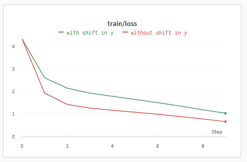
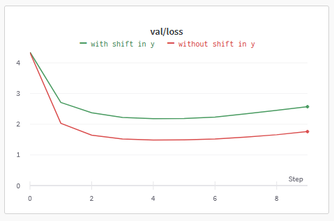

# Training transformer models

Train a GPT2 model from scratch using Shakespeare character-level encoding.

Leveraged repo: https://github.com/karpathy/nanoGPT

## What's different here 

The above linked repo makes it straightforward to complete the following two tasks

- create a GPT model scratch and train it on Shakespeare character-level encoding.
- load a pretrained transformers.GPT2LMHeadModel model and train it on Shakespeare word-level encoding.

What I was interested in was to find out how to:

- use Shakespeare character-level encoding, to better understand encoding
- and use transformers.GPT2LMHeadModel from scratch, since transformers package has more modeling options

I thought it should be straightforward. Turns out it's mostly true, except for how to generate data batches for training. Specifically, since I'm useing transformers.GPT2LMHeadModel, I need NOT shift the response by 1. 

What happens if I shift the data and fit them to the model? The loss turns out higher than not shifting, as shown by plots below. Details are in the function get_batch().

[](./assets/train_loss.png)

[](./assets/val_loss.png)

Let's compare the samples produced by the two versions. 

Without shift in y
```
MENENIUS:
What is this?

COMINIUS:
He would have been more counsel to the people's eyes
Of what is her with his hour.

MENENIUS:
He's a little fellow;
And therein for the people.

CORIOLANUS:
He shall know your father.

BRUTUS:
He hath no further words he mo placed thean
Than o of tempore.


COMINIUS:
He was not amissss'd heris oown:
The word iof Marciumery was to reposesss
Thin heath.


COMINIUS:
He t desirabes,
He hof he f worould s have beeeeteeen tiling
His body with heat.
How were migisty,
```

With shift in y
```
h adiu o ofec i?
Sra,Ih hdrs o oremvs o o ote ud o lvs
hrfm,ad o ul hsae,t h ees o er     hpe er ocaii 
o oe o hrv o hrv!
Se h ntys o oe o hrvcig:h ee' hrw o o od,Iae
apae o oe o hrwenyb nw nwy is er ao.
Prvot euh o hscpn,Ids i eprsnsmn hmn o o oe
hsefet iadnt tesoe i,wihhhhhhhhhh e n   oessssde svrw o
a oe-aerbads o hsadal     o ofeigvne,we o
aee o o hrfmne o o hrskn nnnn ae e o ohra ae nih.
o od e!hsaeh alviseyc o o o   ofm e,te a oe
hsne,te,tr srnemsssw fo hsei ntaevst rsd ngvne o
hmr,wa;frvi
```